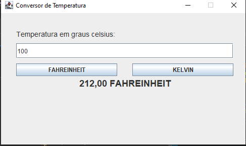
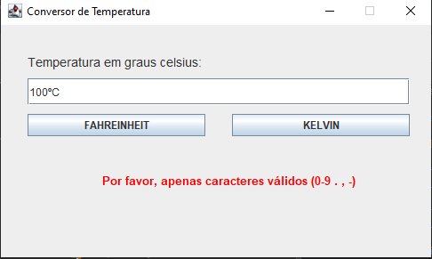

"# Lopal_Conversor-Temperatura" 

Atividade desafio de uso da biblioteca Swing, desenvolvido nas aulas da disciplina Logica e Programação do curso Desenvolvimento de Sistemas no Senai

Tendo como objetivo um aplicativo com interface gráfica capaz de realizar conversão de temperaturas a partir de um valor em graus Celsius, convertendo para Fahrenheit ou Kelvin, utilizando programação orientada a objetos

O programa também está preparado para lidar com erros, instruindo o usuário ao que invalida o input

## Tecnologias utilizadas
* Java

## Autor

[Edvan Alves](https://br.linkedin.com/in/edvan-alves)